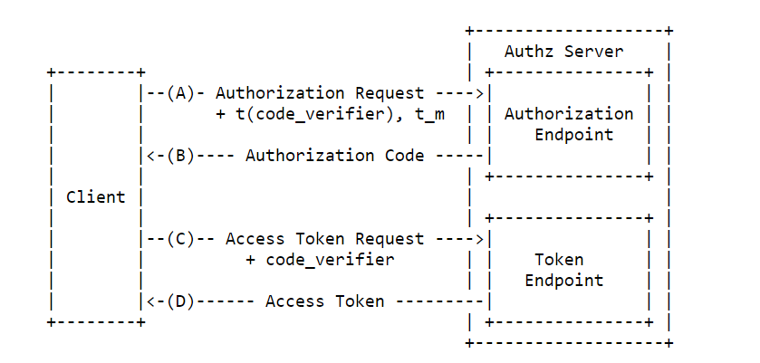

# APS-PKCE-WINFORM

## This is a work in progress

## Introduction

This sample demonstrates a quick workflow to generate a three legged token from a desktop app using [3-Legged Token with Authorization Code Grant (PKCE)](https://aps.autodesk.com/en/docs/oauth/v2/tutorials/get-3-legged-token-pkce/)

## How it works

The token is retrieved at the windows form app, using the UI below:

Where:

1 – Clicking on generate token triggers the process

2 – Once it’s done, token will be posted in the texbox

I uses the workflow below to obtain the token

Where:

1 – user access the Desktop app

2 – app redirects the user to authorization server

3 – after loging in and allowing access, authorization server sends credential code to call-back url

4 – web app receives the code and sends it to desktop app using SignalR

5 – Desktop app sends credential code with code verifier to Exchange it for a token

6 – Oauth API returns the token (including refresh token) to desktop app
